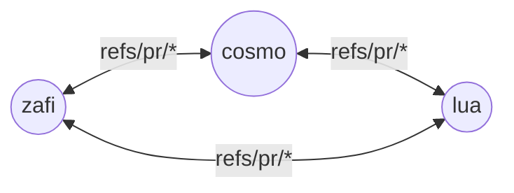
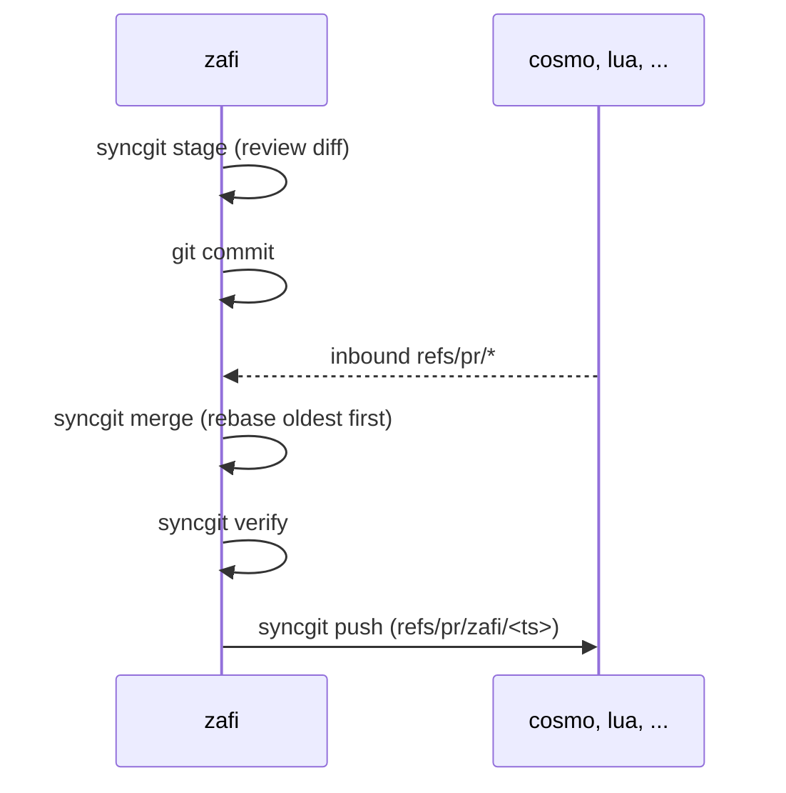

<h1 align="center">syncgit</h1>

<p align="center">
  <strong>Peer-to-peer git for teams of AI agents.</strong>
</p>

<p align="center">
  No main branch. No hub. Just worktrees that talk to each other.
</p>

<p align="center">
  <a href="#installation">Installation</a> •
  <a href="#quick-start">Quick Start</a> •
  <a href="#how-it-works">How It Works</a> •
  <a href="#philosophy">Philosophy</a> •
  <a href="#cli-reference">CLI</a>
</p>

---

## The Problem

You want N Claude agents working on the same project in parallel. You open N terminals, N worktrees, N branches. Now what?

Somebody has to be `main`. Somebody has to merge. Somebody has to rebase when the others land first. You end up babysitting git instead of shipping code — or worse, wiring up a daemon, a queue, a coordinator.

**This is coordination overhead where there should be collaboration.**

## The Solution

syncgit treats every worktree as an equal peer. No central branch, no arbiter. Each agent does its work, then types `/sync` — and its changes flow to every sibling while their changes flow in, rebased into a clean linear history.

One keystroke: stage, commit, absorb everything your peers did, drive the tree back to green, broadcast your own.

No daemon. No server. Just git refs and filesystem paths.

---

## Features

### The `/sync` Loop
- **Stage sensibly** — agent reviews the diff and adds only real work (never logs, `node_modules`, `.env*`)
- **Commit** — short imperative message for the slice
- **Absorb peers** — rebase through every pending peer PR, oldest first
- **Resolve conflicts** — agent edits, continues the rebase, retries; halts with a summary after 3 failed attempts
- **Verify** — runs `.syncgit/verify.sh` if you've put tests there
- **Broadcast** — writes `refs/pr/<self>/<ts>` to every peer and GCs absorbed refs

### Design Choices
- **No daemon, no server** — pure git plus filesystem paths as remotes
- **Rebase, not merge** — linear history across N peers; merge commits would explode combinatorially
- **Agent stages, script doesn't** — what counts as "real work" is judgment, so the script only surfaces evidence
- **Halt over heuristic** — when the agent can't make something clean, it stops and writes `.syncgit/last-halt.md` rather than guessing
- **Worktrees share refs** — a push to one peer is immediately visible to every other peer, no fetch needed

---

## Installation

```sh
git clone https://github.com/<you>/syncgit ~/Code/syncgit
cd ~/Code/syncgit && ./install.sh
```

`install.sh` symlinks `bin/syncgit` into `~/.local/bin` and `commands/sync.md` into `~/.claude/commands/` (if Claude Code is installed). Make sure `~/.local/bin` is on your `PATH`:

```sh
export PATH="$HOME/.local/bin:$PATH"
```

Verify with `syncgit help`. To uninstall: `./install.sh --uninstall`.

---

## Quick Start

### New project

```sh
mkdir ~/Code/myproj && cd ~/Code/myproj
syncgit init --peers zafi cosmo     # any N ≥ 2; use as many names as you want
```

### Existing repo

```sh
cd ~/Code/myrepo
syncgit init --peers zafi cosmo     # any N ≥ 2; use as many names as you want
```

Open one terminal per worktree and launch Claude in each:

```sh
cd ~/Code/myproj/zafi && claude
cd ~/Code/myproj/cosmo && claude
# ...one terminal per peer, however many you initialized
```

Give each agent different work, then type `/sync` in any session to broadcast.

---

## How It Works

```
~/Code/myproj/
  .git/                     shared object + ref store
  .syncgit/peers.json       [{id,path}, ...]
  zafi/    (branch: zafi)
  cosmo/      (branch: cosmo)
  ...       (one worktree/branch per peer)
```

- Each worktree adds every sibling as a local git remote (e.g. `peer-cosmo -> ../cosmo`)
- The PR queue lives in git refs: `refs/pr/<peer-id>/<timestamp>`
- Worktrees share a ref database, so a push to `peer-cosmo` is visible to every peer immediately — no daemon, no central repo
- `/sync` is a Claude Code slash command that orchestrates the whole flow

### Peer topology

Every peer talks to every other peer. No hub, no hierarchy. Works for any N ≥ 2 — shown here with 3 peers.



### The `/sync` loop

One peer's timeline: absorb inbound work *before* broadcasting your own.



---

## CLI Reference

| Command | Action |
|---------|--------|
| `syncgit init --peers a b c` | Create parent + N worktrees, wire remotes |
| `syncgit peers list` | List peers from `.syncgit/peers.json` |
| `syncgit status` | Show inbound/outbound PR queue |
| `syncgit fetch` | Fetch `refs/pr/*` from peers (no-op in local mode) |
| `syncgit stage` | Print a diff for the agent to review |
| `syncgit merge` | Rebase through pending peer PRs, oldest first |
| `syncgit verify` | Run `.syncgit/verify.sh` if present |
| `syncgit push` | Broadcast HEAD to every peer and GC absorbed refs |

`--peers` accepts comma-separated (`a,b,c`), space-separated (`a b c`), or mixed.

---

## Per-Repo Config

Inside any worktree:

- `.syncgit/ignore` — extra paths the agent should never stage
- `.syncgit/verify.sh` (executable) — gate broadcasts on a build/test command

---

## Philosophy

syncgit exists because of a simple observation:

> Agents don't need a manager. They need a protocol.

The instinct when you put N agents on a repo is to elect one as the coordinator — a main branch, a merge queue, a reviewer. But that's a human pattern. Humans need coordinators because humans are slow and expensive and asynchronous. Agents are fast, cheap, and always on.

What agents actually need is a flat protocol: a way to say "here's what I did" and "here's what you did" and reach a clean shared state without asking anyone's permission.

That's all syncgit is. A flat protocol, one keystroke wide.

1. Give each agent a worktree
2. Point them at different work
3. Type `/sync` when they land
4. Repeat

No hub. No hierarchy. No human in the merge loop.

---

## Project CLAUDE.md snippet

Drop this into a project's `CLAUDE.md` so each peer agent uses the syncgit flow:

````markdown
## Peer sync workflow (syncgit)

This repo uses **syncgit** — a peer-to-peer VCS where each git worktree is an equal peer with its own Claude agent. There is no `main` and no central hub. Peers broadcast work to each other as PRs over `refs/pr/*`.

**When you finish a slice of work, run `/sync`.** Do not `git commit` / `git push` manually. The `/sync` slash command orchestrates the full flow:

1. `syncgit stage` — review the diff and `git add` only real work. Never stage logs, `node_modules`, `dist`, `.env*`, or anything listed in `.syncgit/ignore`.
2. Commit with a short imperative message scoped to this slice.
3. `syncgit merge` — rebase through every pending peer PR, oldest first.
4. On conflict: resolve in-file, `git rebase --continue`, re-run `syncgit merge`. After 3 failed attempts, abort and halt with a summary in `.syncgit/last-halt.md` rather than guessing.
5. `syncgit verify` — must pass before broadcast if `.syncgit/verify.sh` exists.
6. `syncgit push` — broadcasts `HEAD` to every peer.

**Rules:**
- Always merge inbound peer PRs *before* broadcasting your own.
- Rebase, never merge-commit — history stays linear across peers.
- If you can't make the tree clean, **halt** and write `.syncgit/last-halt.md`. Do not force-push, do not `--no-verify`, do not skip `syncgit verify`.
- Check peer state with `syncgit status` before starting non-trivial work so you don't duplicate a sibling's effort.
- Your peer identity is the worktree directory name; treat sibling worktrees as independent collaborators, not as backups.
````

---

## Teardown

```sh
cd ~/Code/myproj
for p in zafi cosmo; do git worktree remove "$p"; done   # one per peer
git branch -D zafi cosmo
rm -rf .syncgit
```

---

## Repo Layout

```
syncgit/
├── bin/
│   ├── syncgit           # CLI entrypoint
│   └── lib.sh            # shared helpers
├── commands/
│   └── sync.md           # /sync slash command
├── install.sh            # symlink installer
├── README.md
└── LICENSE
```

---

## Contributing

syncgit is open source under the MIT license.

The best way to contribute right now is to **use it and report what breaks**. File issues with:
- What you were trying to do
- What happened instead
- The peer layout and `.syncgit/peers.json` if you can share them

---

## License

MIT © Truman Ellis

---

<p align="center">
  <sub>Many hands. One tree. No hub.</sub>
</p>
