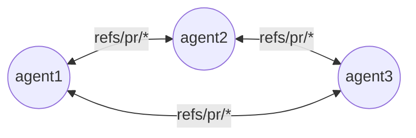
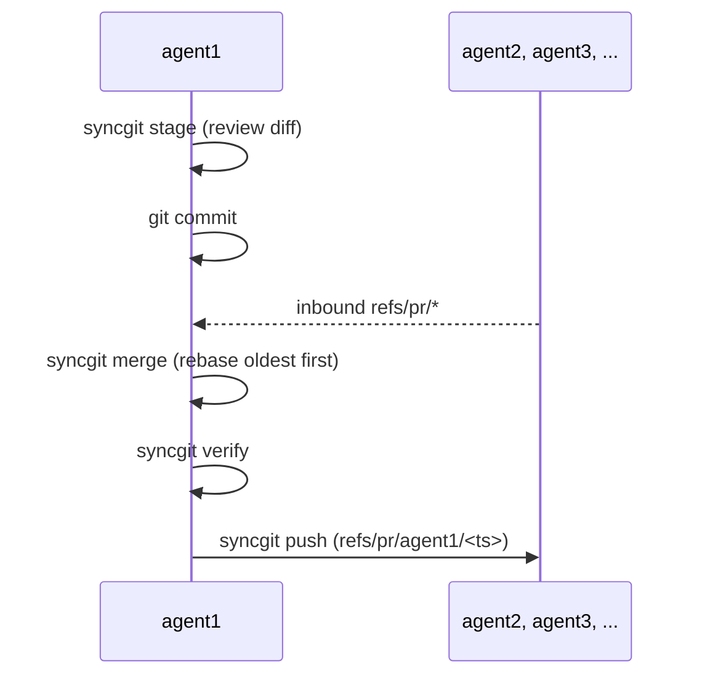

<h1 align="center">syncgit</h1>

<p align="center">
  <strong>Peer-to-peer git for teams of agents — human or AI.</strong>
</p>

<p align="center">
  No main branch. No hub. Just worktrees that talk to each other.
</p>

<p align="center">
  <a href="https://github.com/trumanellis/syncgit/blob/main/LICENSE"></a>
  
  
</p>

<p align="center">
  <a href="#requirements">Requirements</a> •
  <a href="#quick-start">Quick Start</a> •
  <a href="#walkthrough">Walkthrough</a> •
  <a href="#how-it-works">How It Works</a> •
  <a href="#cli-reference">CLI</a> •
  <a href="#faq">FAQ</a> •
  <a href="#troubleshooting">Troubleshooting</a>
</p>

---

## The Problem

You want N workers — agents, humans, or a mix — on the same project in parallel. You open N terminals, N worktrees, N branches. Now what?

Somebody has to be `main`. Somebody has to merge. Somebody has to rebase when the others land first. You end up babysitting git instead of shipping code — or worse, wiring up a daemon, a queue, a coordinator.

**This is coordination overhead where there should be collaboration.**

## The Solution

syncgit treats every worktree as an equal peer. No central branch, no arbiter. Each worker does its work, then runs `syncgit` — and its changes flow to every sibling while their changes flow in, rebased into a clean linear history.

One command: stage, commit, absorb everything your peers did, drive the tree back to green, broadcast your own.

No daemon. No server. Just git refs and filesystem paths.

> syncgit is a **protocol + CLI**, not an agent integration. It works with AI agents (Claude Code, Codex, Aider, Cursor), human developers in tmux panes, or any mix of the two. Claude Code just happens to ship a `/sync` slash command that wraps the CLI — see [Frontends](#frontends) for others.

---

## Requirements

- `git` ≥ 2.25 (worktree ref sharing)
- `bash` ≥ 4 (macOS ships 3.2 — install via Homebrew, or syncgit falls back to POSIX where possible)
- macOS, Linux, or WSL. Native Windows is untested.
- Optional: [Claude Code](https://claude.com/claude-code) for the `/sync` slash command. Any other agent or human driver works via the `syncgit` CLI directly.

---

## Installation

```sh
git clone https://github.com/trumanellis/syncgit ~/Code/syncgit
cd ~/Code/syncgit && ./install.sh
```

`install.sh` symlinks `bin/syncgit` into `~/.local/bin` and `commands/sync.md` into `~/.claude/commands/` (if Claude Code is installed). Make sure `~/.local/bin` is on your `PATH`:

```sh
export PATH="$HOME/.local/bin:$PATH"
```

Verify with `syncgit help`. To uninstall: `./install.sh --uninstall`.

---

## Quick Start

```sh
# new project or existing repo — same command
cd ~/Code/myproj
syncgit init --peers agent1 agent2 agent3   # any N ≥ 2
```

Open one terminal per worktree and launch whatever driver you use — Claude Code, Codex, Aider, a human in `$EDITOR`, etc.:

```sh
cd ~/Code/myproj/agent1 && claude   # or: codex, aider, vim, ...
cd ~/Code/myproj/agent2 && claude
cd ~/Code/myproj/agent3 && claude
# ...one terminal per peer, however many you initialized
```

Give each worker different work. When one finishes a slice, run `syncgit` (or `/sync` in Claude Code) to broadcast.

---

## Walkthrough

A concrete two-peer run. `agent1` edits `api.py`, `agent2` edits `ui.tsx`, independently.

```
# peer agent1
$ syncgit stage
  modified: api.py       (+42 -3)    ← staged
  modified: logs/run.log            ← ignored
$ git commit -m "add /healthz endpoint"
$ syncgit merge
  no inbound PRs.
$ syncgit verify
  .syncgit/verify.sh → pass
$ syncgit push
  → peer-agent2   refs/pr/agent1/1713204011
  → peer-agent3   refs/pr/agent1/1713204011
```

Meanwhile `agent2` finished first and already broadcast. When `agent1` syncs **next**, it absorbs:

```
$ syncgit merge
  inbound: refs/pr/agent2/1713203880  "wire up settings page"
  rebasing agent1 onto agent2's commit... ok (no conflicts)
  GC: refs/pr/agent2/1713203880 absorbed
$ syncgit push
  → peer-agent2   refs/pr/agent1/1713204044
  → peer-agent3   refs/pr/agent1/1713204044
```

Result: a single linear history containing both slices, viewable from either worktree. No merge commits, no human in the loop.

---

## Features

### The `syncgit` Loop
- **Stage sensibly** — worker reviews the diff and adds only real work (never logs, `node_modules`, `.env*`)
- **Commit** — short imperative message for the slice
- **Absorb peers** — rebase through every pending peer PR, oldest first
- **Resolve conflicts** — worker edits, continues the rebase, retries; halts with a summary after 3 failed attempts
- **Verify** — runs `.syncgit/verify.sh` if you've put tests there
- **Broadcast** — writes `refs/pr/<self>/<ts>` to every peer and GCs absorbed refs

### Design Choices
- **No daemon, no server** — pure git plus filesystem paths as remotes
- **Rebase, not merge** — linear history across N peers; merge commits would explode combinatorially
- **Worker stages, script doesn't** — what counts as "real work" is judgment, so the script only surfaces evidence
- **Halt over heuristic** — when the worker can't make something clean, it stops and writes `.syncgit/last-halt.md` rather than guessing
- **Worktrees share refs** — a push to one peer is immediately visible to every other peer, no fetch needed

---

## How It Works

```
~/Code/myproj/
  .git/                     shared object + ref store
  .syncgit/peers.json       [{id,path}, ...]
  agent1/  (branch: agent1)
  agent2/  (branch: agent2)
  agent3/  (branch: agent3)
  ...      (one worktree/branch per peer)
```

- Each worktree adds every sibling as a local git remote (e.g. `peer-agent2 -> ../agent2`)
- The PR queue lives in git refs: `refs/pr/<peer-id>/<timestamp>`
- Worktrees share a ref database, so a push to `peer-agent2` is visible to every peer immediately — no daemon, no central repo
- A frontend (the `syncgit` CLI itself, or a slash command like `/sync`) orchestrates the loop

### Peer topology

Every peer talks to every other peer. No hub, no hierarchy. Works for any N ≥ 2 — shown here with 3 peers.



### The sync loop

One peer's timeline: absorb inbound work *before* broadcasting your own.



---

## Comparison

| Approach | Central branch? | Coordinator? | History shape | Fits N agents? |
|---|---|---|---|---|
| Plain `git worktree` + `main` | Yes | Yes (whoever merges) | Messy merges or rebase churn | Poorly — someone babysits |
| GitHub merge queue | Yes | Yes (queue service) | Linear | Yes, but needs a server + review pass |
| Stacked PRs (Graphite, etc.) | Yes | Yes | Linear-ish per stack | Single author per stack |
| Manual rebase across branches | No (in theory) | Implicit | Linear if disciplined | Breaks at N ≥ 3 |
| **syncgit** | **No** | **None** | **Linear** | **Yes, any N** |

syncgit trades the review gate for autonomy — appropriate when peers are trusted (your own agents, your own machines) and inappropriate when you need human review before code lands.

---

## CLI Reference

Commands marked **(auto)** are normally invoked by a frontend like `/sync`; **(human)** are for inspection and setup.

| Command | Action | Typical caller |
|---------|--------|---|
| `syncgit init --peers a b c` | Create parent + N worktrees, wire remotes | human |
| `syncgit peers list` | List peers from `.syncgit/peers.json` | human |
| `syncgit status` | Show inbound/outbound PR queue | human |
| `syncgit fetch` | Fetch `refs/pr/*` from peers (no-op in local mode) | auto |
| `syncgit stage` | Print a diff for the worker to review | auto |
| `syncgit merge` | Rebase through pending peer PRs, oldest first | auto |
| `syncgit verify` | Run `.syncgit/verify.sh` if present | auto |
| `syncgit push` | Broadcast HEAD to every peer and GC absorbed refs | auto |

`--peers` accepts comma-separated (`a,b,c`), space-separated (`a b c`), or mixed.

---

## Frontends

syncgit is driver-agnostic. The CLI is the protocol; anything can call it.

- **Claude Code** — ships with the `/sync` slash command (installed by `install.sh`). See [`commands/sync.md`](commands/sync.md).
- **Other AI agents** (Codex, Aider, Cursor, etc.) — give them the instructions in [`CLAUDE.md.example`](CLAUDE.md.example) adapted to their config format. The steps are the same: `stage → commit → merge → verify → push`.
- **Humans** — just run the commands in order. `syncgit status` is your friend.
- **Scripts / CI** — the CLI is non-interactive and exits non-zero on halt; wrap it however you want.

---

## Per-Repo Config

Inside any worktree:

- `.syncgit/ignore` — extra paths the worker should never stage
- `.syncgit/verify.sh` (executable) — gate broadcasts on a build/test command
- `.syncgit/last-halt.md` — written by `syncgit` when it refuses to continue; safe to delete after resolving

---

## FAQ

**What if two peers edit the same file?**
The second peer to sync will hit a rebase conflict. An agent resolves it in-file and `git rebase --continue`s; a human does the same. After 3 failed attempts syncgit halts with a summary in `.syncgit/last-halt.md` rather than guessing.

**Can I use a real remote (GitHub, GitLab)?**
Yes — add one as a normal git remote inside any worktree. syncgit only manages `refs/pr/*`; your `origin` is untouched. Push a stable branch to `origin` when you want to publish externally.

**How does this interact with pre-commit hooks?**
They run normally during the commit step. If a hook fails, the sync halts — syncgit will not `--no-verify` behind your back.

**What happens if a peer crashes mid-sync?**
Its worktree is left mid-rebase. Run `git status` inside it; either `git rebase --abort` to discard, or resolve and `git rebase --continue`, then `syncgit push` manually. No other peer is affected — they only see pushed refs.

**Can I add or remove peers later?**
Yes. `syncgit init --peers ...` is idempotent for adding; removing is `git worktree remove <name> && git branch -D <name>` plus editing `.syncgit/peers.json`. A dedicated `syncgit peers add/remove` is on the roadmap.

**Does this scale to N = 20?**
The protocol does; the human supervision doesn't. Practical sweet spot is 2–5 peers. Conflict frequency grows with N and with overlap in the work assignment.

**Why not just use `git pull --rebase` in a loop?**
That's roughly what `syncgit merge` does — plus peer discovery, ref namespacing, GC of absorbed PRs, halt semantics, and verify gating. You could reimplement it yourself; syncgit is the opinionated version.

---

## Troubleshooting

**`syncgit` halted with `.syncgit/last-halt.md`.**
Read the file. It names the failing step (stage / rebase / verify) and the last error. Fix the underlying issue, then re-run `syncgit` from where it stopped — each subcommand is individually callable.

**Stuck mid-rebase.**
`git status` shows the state. To recover: `git rebase --abort` discards in-progress work; `git rebase --continue` after resolving conflicts resumes. Once clean, run `syncgit verify && syncgit push`.

**PR queue looks wrong.**
`syncgit status` prints inbound and outbound refs. To nuke the queue for one peer: `git for-each-ref refs/pr/<peer>/ --format='%(refname)' | xargs -n1 git update-ref -d`. Absorbed refs are GC'd automatically on `push`.

**Accidentally committed to the wrong peer.**
Cherry-pick onto the correct peer, then reset the wrong one: `git reset --hard HEAD~1` (only safe if you haven't pushed yet — nothing has if you haven't run `syncgit push`).

**`install.sh` didn't symlink `/sync`.**
It only installs the slash command if `~/.claude/commands/` exists. Install Claude Code first, or copy `commands/sync.md` wherever your frontend expects slash commands.

**Worktree says `branch is already checked out`.**
Another worktree owns that branch. `git worktree list` shows who. This is normal — each peer has its own branch.

---

## Philosophy

syncgit exists because of a simple observation:

> Workers don't need a manager. They need a protocol.

The instinct when you put N workers on a repo is to elect one as the coordinator — a main branch, a merge queue, a reviewer. But that's a human-scale pattern built for slow, expensive, asynchronous collaborators. When your peers are fast, cheap, and always on (or are just you in five tmux panes), the overhead dominates the work.

What they actually need is a flat protocol: a way to say "here's what I did" and "here's what you did" and reach a clean shared state without asking anyone's permission.

That's all syncgit is. A flat protocol, one command wide.

1. Give each worker a worktree
2. Point them at different work
3. Run `syncgit` when they land
4. Repeat

No hub. No hierarchy. No human in the merge loop.

---

## Project config snippet

Drop the contents of [`CLAUDE.md.example`](CLAUDE.md.example) into your project's `CLAUDE.md`, `AGENTS.md`, `.cursorrules`, or equivalent so each peer worker uses the syncgit flow.

---

## Teardown

```sh
cd ~/Code/myproj
for p in agent1 agent2 agent3; do git worktree remove "$p"; done   # one per peer
git branch -D agent1 agent2 agent3
rm -rf .syncgit
```

---

## Repo Layout

```
syncgit/
├── bin/
│   ├── syncgit           # CLI entrypoint
│   └── lib.sh            # shared helpers
├── commands/
│   └── sync.md           # /sync slash command (Claude Code frontend)
├── CLAUDE.md.example     # drop-in project config for agent drivers
├── install.sh            # symlink installer
├── README.md
└── LICENSE
```

---

## Contributing

syncgit is open source under the MIT license.

The best way to contribute right now is to **use it and report what breaks**. File issues with:
- What you were trying to do
- What happened instead
- The peer layout and `.syncgit/peers.json` if you can share them

---

## License

MIT © Truman Ellis

---

<p align="center">
  <sub>Many hands. One tree. No hub.</sub>
</p>
