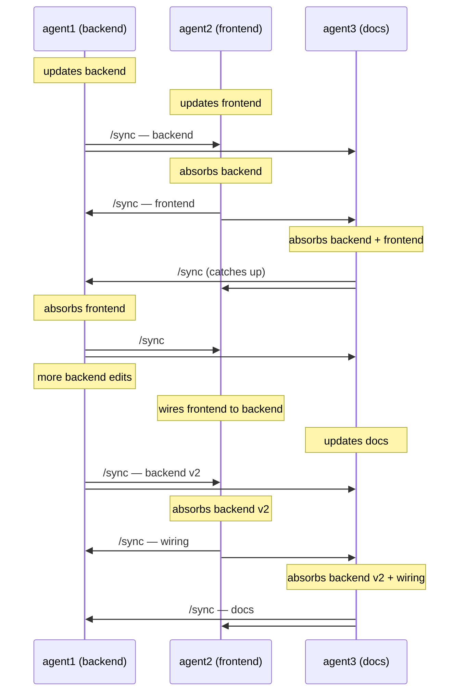

<h1 align="center">syncgit</h1>

<p align="center">
  <strong>One command to sync parallel Claude Code worktrees.</strong>
</p>

<p align="center">
  Type <code>/sync</code>. Your work goes out, their work comes in, history stays clean.
</p>

---

## Why

Running three Claude agents in three worktrees sounds great until you try to merge their work. Somebody has to be `main`. Somebody has to rebase. Somebody has to decide whose branch wins. You spend more time shepherding git than shipping code.

`/sync` is a Claude Code slash command that does the whole dance for you — review the diff, commit, rebase in every peer's work, verify, broadcast. One keystroke from any worktree. No central branch, no merge queue, no human in the loop.

## What `/sync` looks like

Three agents on a project — backend, frontend, docs. Each `/sync` absorbs whatever peers have broadcast, then pushes its own work back out. Order doesn't matter; the history converges.

Each `/sync` broadcasts to every other peer — one action, an arrowhead at each recipient.



By the end every worktree has the same linear history: backend → frontend → backend v2 → wiring → docs. Nobody had to be `main`.

## Quick start

```sh
# install
git clone https://github.com/trumanellis/syncgit ~/Code/syncgit
cd ~/Code/syncgit && ./install.sh
```

The installer drops `/sync` into `~/.claude/commands/` so every Claude Code session can use it.

```sh
# set up a project
cd ~/Code/myproj
syncgit init --peers agent1 agent2 agent3
```

```sh
# one terminal per peer
cd ~/Code/myproj/agent1 && claude
cd ~/Code/myproj/agent2 && claude
cd ~/Code/myproj/agent3 && claude
```

Give each agent different work. When one finishes, it types `/sync`.

## Project setup

Drop [`CLAUDE.md.example`](CLAUDE.md.example) into your project's `CLAUDE.md` so each agent knows to use `/sync` instead of committing manually.

Optional per-repo config inside any worktree:
- `.syncgit/ignore` — extra paths never to stage
- `.syncgit/verify.sh` (executable) — gate broadcasts on a build/test

## What happens under the hood

Each worktree adds every sibling as a local git remote. The "PR queue" between peers is just git refs (`refs/pr/<peer>/<timestamp>`). Worktrees share a ref database, so a push to one peer is instantly visible to every other peer — no daemon, no server, no central repo. `/sync` is a thin orchestrator over the `syncgit` CLI that wraps the whole loop.

If a rebase can't resolve cleanly after 3 tries, the agent halts and writes `.syncgit/last-halt.md` rather than guessing.

## Not married to Claude Code

`/sync` is the Claude Code frontend, but syncgit itself is a CLI plus a git ref convention — any agent or human can drive the same loop. See [`bin/syncgit`](bin/syncgit) for the underlying commands.

## Teardown

```sh
cd ~/Code/myproj
for p in agent1 agent2 agent3; do git worktree remove "$p"; done
git branch -D agent1 agent2 agent3
rm -rf .syncgit
```

## License

MIT © Truman Ellis

<p align="center">
  <sub>Many hands. One tree. No hub.</sub>
</p>
