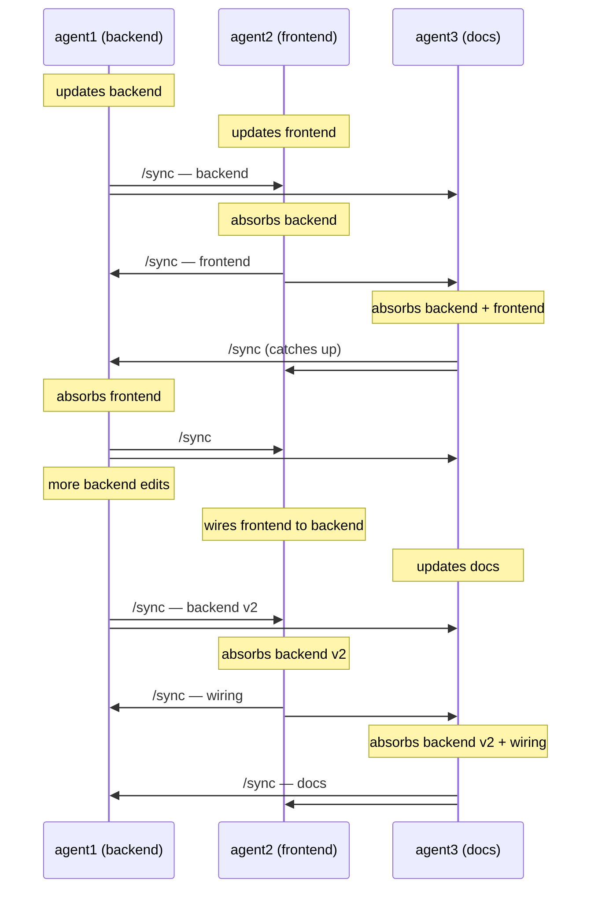

<h1 align="center">syncgit</h1>

<p align="center">
  <strong>One command to sync parallel Claude Code worktrees.</strong>
</p>

<p align="center">
  Type <code>/sync</code>. Your work goes out, their work comes in, history stays clean.
</p>

---

## Why

Running three Claude agents in three worktrees sounds great until you try to merge their work. Somebody has to be `main`. Somebody has to rebase. Somebody has to decide whose branch wins. You spend more time shepherding git than shipping code.

`/sync` is a Claude Code slash command that does the whole dance for you — review the diff, commit, rebase in every peer's work, verify, broadcast. One keystroke from any worktree. No central branch, no merge queue, no human in the loop.

## What `/sync` looks like

Three agents on a project — backend, frontend, docs. Each `/sync` absorbs whatever peers have broadcast, then pushes its own work back out. Order doesn't matter; the history converges.

Each `/sync` broadcasts to every other peer — one action, an arrowhead at each recipient.



By the end every worktree has the same linear history: backend → frontend → backend v2 → wiring → docs. Nobody had to be `main`.

## Quick start

```sh
# install
git clone https://github.com/trumanellis/syncgit ~/Code/syncgit
cd ~/Code/syncgit && ./install.sh
```

The installer drops `/sync` into `~/.claude/commands/` so every Claude Code session can use it.

```sh
# set up a project
cd ~/Code/myproj
syncgit init --peers agent1 agent2 agent3
```

```sh
# one terminal per peer
cd ~/Code/myproj/agent1 && claude
cd ~/Code/myproj/agent2 && claude
cd ~/Code/myproj/agent3 && claude
```

Give each agent different work. When one finishes, it types `/sync`.

## Project setup

Drop [`CLAUDE.md.example`](CLAUDE.md.example) into your project's `CLAUDE.md` so each agent knows to use `/sync` instead of committing manually.

Optional per-repo config inside any worktree:
- `.syncgit/ignore` — extra paths never to stage
- `.syncgit/verify.sh` (executable) — gate broadcasts on a build/test

## What happens under the hood

Each worktree adds every sibling as a local git remote. The "PR queue" between peers is just git refs (`refs/pr/<peer>/<timestamp>`). Worktrees share a ref database, so a push to one peer is instantly visible to every other peer — no daemon, no server, no central repo. `/sync` is a thin orchestrator over the `syncgit` CLI that wraps the whole loop.

If a rebase can't resolve cleanly after 3 tries, the agent halts and writes `.syncgit/last-halt.md` rather than guessing.

## Subcommands

| Command | Purpose |
|---------|---------|
| `syncgit init --peers a,b,c` | Create parent repo and N worktrees, wire remotes |
| `syncgit peers list\|add\|remove` | Manage peer set (add/remove work live) |
| `syncgit status` | Show inbound/outbound PR queue |
| `syncgit fetch` | Fetch refs/pr/* from every peer (seam for network transport) |
| `syncgit stage` | Show categorized diff for agent review |
| `syncgit merge` | Absorb pending peer PRs |
| `syncgit verify` | Run .syncgit/verify.sh if present |
| `syncgit push` | Broadcast HEAD to peers and run GC |
| `syncgit gc` | Garbage-collect absorbed and TTL-expired PR refs |
| `syncgit show <ref>` | Show log and diffstat of `<ref>` relative to HEAD |
| `syncgit abort` | Roll back to pre-merge or pre-squash snapshot |
| `syncgit squash` | Collapse self-authored commits since last push into one |
| `syncgit unlock` | Remove a stale `.syncgit/lock` left by a crashed agent |

Global flags: `-q`/`--quiet`, `-v`/`--verbose`, `--version`/`-V`, `-h`/`--help`. Every subcommand also accepts `-h`/`--help`.

## Requirements

- Bash ≥ 3.2 (macOS default works)
- Git ≥ 2.23
- Python 3 ≥ 3.6 (date math and JSON parsing)
- macOS or Linux (Windows likely works under Git Bash; untested)

## Configuration

Environment variables:

| Variable | Default | Description |
|---|---|---|
| `SYNCGIT_MERGE_STRATEGY` | `merge` | `merge` preserves all peer SHAs via merge-commit chain. `rebase` gives strictly linear history; only the last peer's SHA survives. See `docs/architecture.md`. |
| `SYNCGIT_TTL_DAYS` | `14` | Refs older than this (days) are dropped during `gc` / `push`. |
| `SYNCGIT_VERBOSITY` | `normal` | `quiet` / `normal` / `verbose`. Equivalent to the `-q` / `-v` global flags. |

## How merging works

When you run `syncgit merge`, it absorbs every pending peer PR in chronological order. By default (merge strategy), it chains the peer refs together with merge commits, so every peer's original commit SHA remains reachable in your history—critical for GC to detect absorption. If you prefer strict linear history, set `SYNCGIT_MERGE_STRATEGY=rebase` to get the legacy behavior, though only the last peer's SHA survives the rebase intact.

## Squashing your own commits

`syncgit squash` collapses all of your commits made since your last `syncgit push` into a single commit. It only touches commits you authored — peer commits and merge commits in the same range cause it to refuse with a clear message (push first to broadcast, then squash on the next round).

To identify which commits are "yours", `syncgit init` sets a per-worktree git identity (`git config user.name <peer-id>`) on each worktree it creates. This is a local, worktree-scoped config — it does not touch your global `~/.gitconfig`. If you ever need to re-initialize the identity (e.g. on a worktree created before this feature), run `git config user.name <your-peer-id>` inside the worktree, or re-run `syncgit init` to have it applied automatically.

## Exit codes

| Code | Meaning |
|---|---|
| `0` | Success |
| `1` | User error or partial broadcast (see stderr) |
| `2` | Halted — see `.syncgit/last-halt.md` for details |
| `3` | Merge or rebase conflict — see the error message for the resolution path |

## Troubleshooting

**Lock stuck after a crash.** Run `syncgit unlock` from inside the worktree. The lock is a directory at `.syncgit/lock`; unlock removes it unconditionally.

**"previous merge in progress".** A previous `syncgit merge` left a snapshot (`refs/syncgit/pre-merge`). Either run `syncgit push` to broadcast the merged state, or `syncgit abort` to roll back to the pre-merge state.

**Chain-merge conflict.** When two peer branches edit the same lines, the default `merge` strategy auto-rolls-back to your original branch and prints recovery instructions. Retry with `SYNCGIT_MERGE_STRATEGY=rebase syncgit merge` to surface per-peer conflicts one at a time. Resolve each with `git add <files> && git rebase --continue`. `syncgit abort` is available to roll back at any point.

**"squash refuses with mixed range".** The commit range contains peer commits or merge commits. Run `syncgit push` first to broadcast, then squash on the next round when the range is clean self-authored commits only.

**Disjoint history error.** A peer was bootstrapped from a different seed commit and shares no common ancestor with HEAD. Inspect the offending peer ref with `syncgit show <ref>` and remove it manually if it is not legitimate.

## Testing and CI

Run the test suite locally:

```sh
bash tests/run.sh
```

The suite runs 9 black-box scenarios covering init, peers, merge strategies, GC, abort, squash, and unlock.

CI runs on every push and pull request via GitHub Actions:
- Matrix: `ubuntu-latest` and `macos-latest`
- shellcheck lints all shell scripts
- Full test suite runs on both platforms

## OS coverage

| OS | Status |
|---|---|
| macOS 14+ | tested |
| Ubuntu 22.04+ | tested via CI |
| Windows | untested (Git Bash should work) |

## Documentation

- [`docs/architecture.md`](docs/architecture.md) — peer SHA preservation, merge-commit chain design
- [`docs/security.md`](docs/security.md) — trust model, attack surface, verify.sh guidance
- [`CHANGELOG.md`](CHANGELOG.md) — release history
- [`CONTRIBUTING.md`](CONTRIBUTING.md) — development setup, commit style, releasing
- [`examples/`](examples/) — sample `.syncgit/verify.sh` and `.syncgit/ignore`

## Not married to Claude Code

`/sync` is the Claude Code frontend, but syncgit itself is a CLI plus a git ref convention — any agent or human can drive the same loop. See [`bin/syncgit`](bin/syncgit) for the underlying commands.

## Teardown

```sh
cd ~/Code/myproj
for p in agent1 agent2 agent3; do git worktree remove "$p"; done
git branch -D agent1 agent2 agent3
rm -rf .syncgit
```

## Stewardship

syncgit is stewarded by [templesofrefuge.earth](https://templesofrefuge.earth) and is part of the [syncengine.earth](https://syncengine.earth) project — an expression of the same flat-protocol, no-hub ethos applied to code coordination.

## License

MIT © Truman Ellis

<p align="center">
  <sub>Many hands. One tree. No hub.</sub>
</p>
